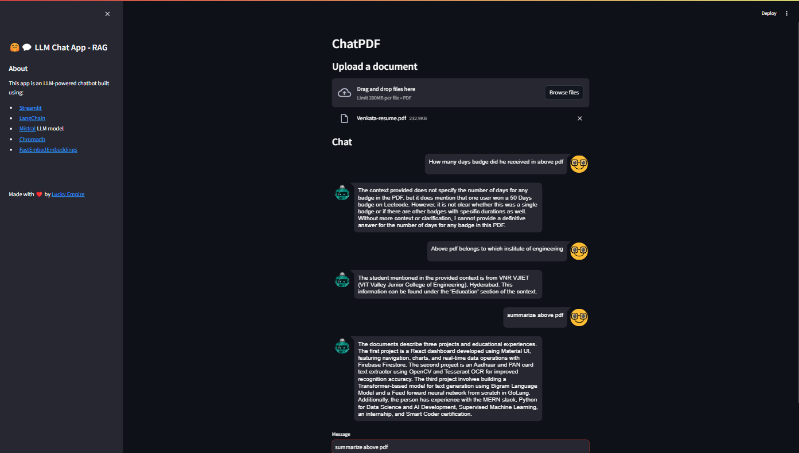
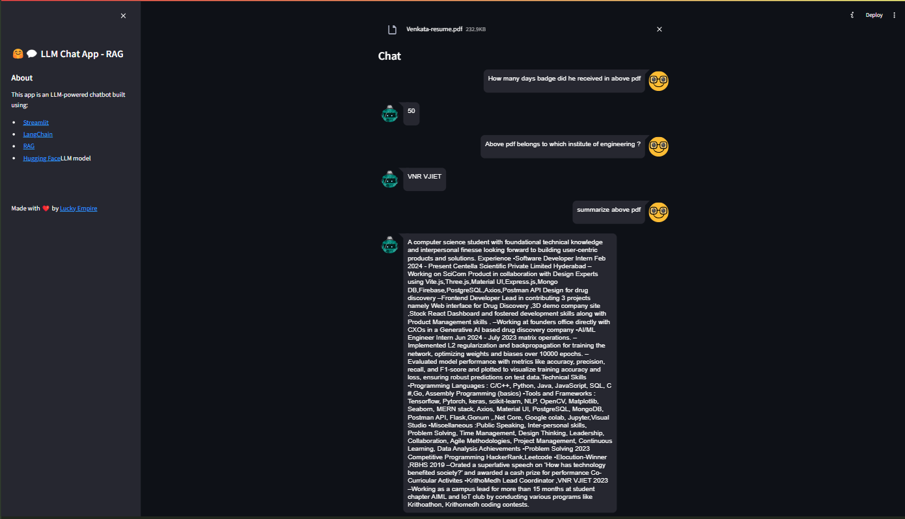

# rag-norag


# ChatPDF

ChatPDF is a project designed to explore and implement various Language Model (LLM) architectures and techniques, focusing on Retrieval-Augmented Generation (RAG) and different embedding strategies. It includes implementations using local RAG with FastEmbedEmbeddings and a version with RAG using Hugging Face Hub for embeddings.

## Features

# 1)  Retrieval-Augmented Generation (RAG):

   - Local RAG Implementation: Uses FastEmbedEmbeddings for local embedding and retrieval.
   - Vector Store: Utilizes ChromaDB for storing and retrieving document embeddings based on similarity scores.
# 2)  Hugging Face Hub Integration:

   - Implements LLMs using models from Hugging Face Hub, specifically the google/flan-t5-large model for efficient and accurate response generation.
# 3)  PDF Ingestion and Processing:

   - Allows users to upload PDF documents, which are then processed to extract text.
   - The extracted text is split into manageable chunks using RecursiveCharacterTextSplitter.
# 4) Interactive Chat Interface:

   - Provides a user-friendly interface for uploading documents and querying their content.
   - Users can ask questions related to the uploaded PDF documents and receive concise, relevant answers.
# 5) Visual Feedback:

   - Incorporates spinners and other visual indicators to show processing progress during document ingestion and query handling.
## Requirements

- Python 3.6+
- Streamlit
- LangChain
- PyPDF2
- Faiss
- Chromadb
- ChatOllama
- Mistral
- HuggingFaceHub
- LLMChain
- scikit-learn
- Streamlit Extras
- Dotenv
- NumPy
- Pickle
  
## Installation

1. Clone the repository:
   ```bash
   git clone https://github.com/your_username/ChatPDF.git
   cd ChatPDF
   ```

2. Install dependencies:
   You can add the entire Tech stack/Requirements in a requirements.txt file :
   ```bash 
   pip install -r requirements.txt
   ```

3. Set up environment variables:
   - Create a `.env` file in the project root directory.
   - Add your Hugging Face Hub API token:
     ```
     HUGGINGFACEHUB_API_TOKEN=your_api_token_here
     ```

## Usage

### 1. Running the App

To run the ChatPDF application:

```bash
streamlit run app.py
```
### 2. PDF Ingestion and Querying:

   - Upload a PDF document through the provided interface.
   - Ask questions related to the content of the uploaded PDF.
### Switching Between Implementations

> **Local RAG Implementation (FastEmbedEmbeddings)**:
  - UnComment lines from 2 to 88 in `app.py`.
  - Uncomment lines from 2 to 61 in `rag.py`.

> **Local RAG Implementation (Hugging Face Hub)**:
  - UnComment lines from 91 to 228 in `app.py`.
  - Uncomment lines from 67 to 137 in `rag.py`.
# For one implementation to be performed comment those above mentioned lines of other implementation and uncomment which approach you wanna use.
## Results

### RAG Implementation (with FastEmbedEmbeddings)




### Without RAG (using Hugging Face Hub)



## Code Structure

- `app.py`: Main application file controlling the Streamlit interface and logic.
- `rag.py`: Contains the `ChatPDF` class implementing local RAG with FastEmbedEmbeddings.
- `results/`: Directory containing result images.
- `__pycache__/`, `.pkl` files, `run.sh`, `pyproject.toml`: Supporting files and artifacts.

## Detailed Code Overview

### `app.py`

This file initializes the Streamlit application, handles PDF ingestion, text processing, embeddings generation, and user interactions. It integrates with Hugging Face Hub for LLM and provides an interface to switch between RAG implementations.

### `rag.py`

Defines the `ChatPDF` class utilizing LangChain components for PDF ingestion, text splitting, embedding generation with FastEmbedEmbeddings, and local RAG implementation.

## Contributing

Contributions are welcome! Please fork the repository, create a feature branch, commit your changes, and submit a pull request.

## Acknowledgements

- **LangChain**: Used for text processing, embeddings, and chaining LLMs.
- **Hugging Face**: Provides models and infrastructure for LLMs.
- **Streamlit**: Framework for building interactive web applications.
- **PyPDF2**: PDF file processing library.
- **Faiss**: Efficient similarity search and clustering of dense vectors used in code without RAG implementation .
- **NumPy**: Fundamental package for scientific computing with Python.
- **ChromaDB**: Vector store for fast and scalable vector similarity search.
- **ChatOllama**: Framework for building conversational agents.
- **Ollama's Mistral Model**: LLM used for question-answering tasks.
- **LLMChain**: For chaining LLMs in the processing pipeline.
- **Scikit-learn**: Machine learning library for the TfidfVectorizer used in embedding generation.
- **Pickle**: Python module for serializing and deserializing Python object structures, used for saving and loading model data.

## Contact

For questions, issues, or suggestions, contact [Vvslaxman](mailto:vvslaxman14@gmail.com).

