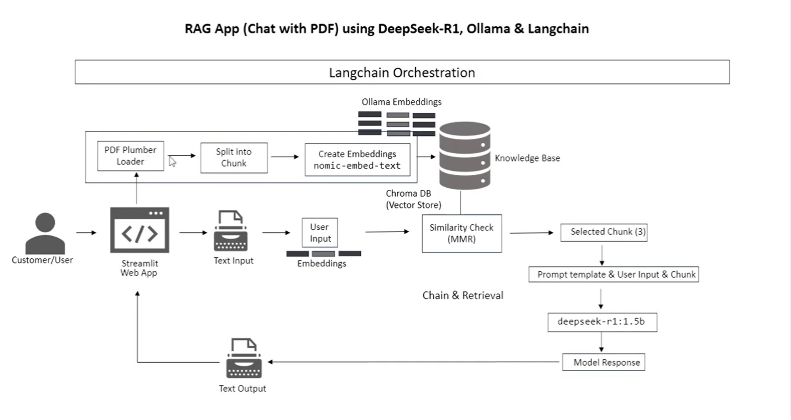
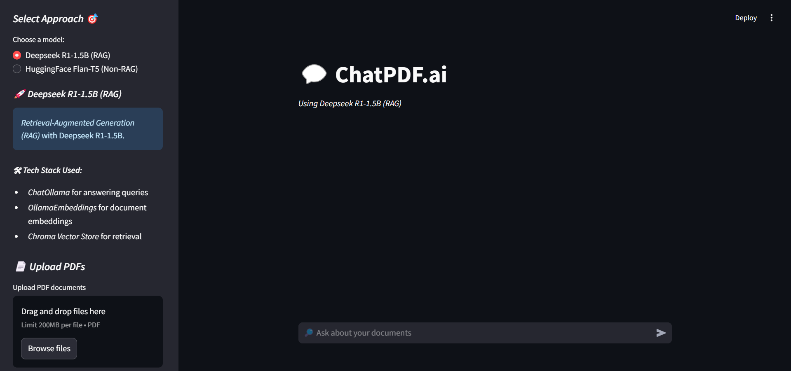
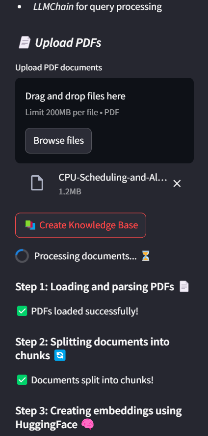
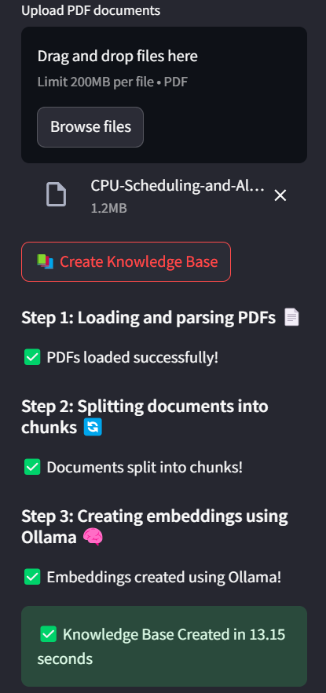
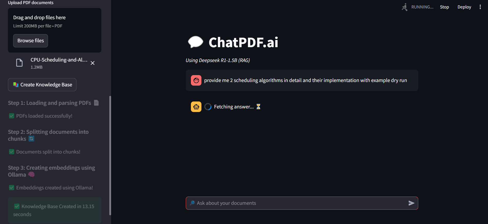
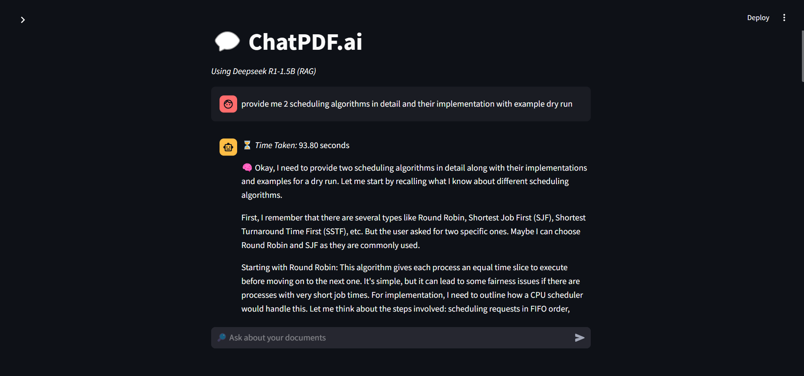
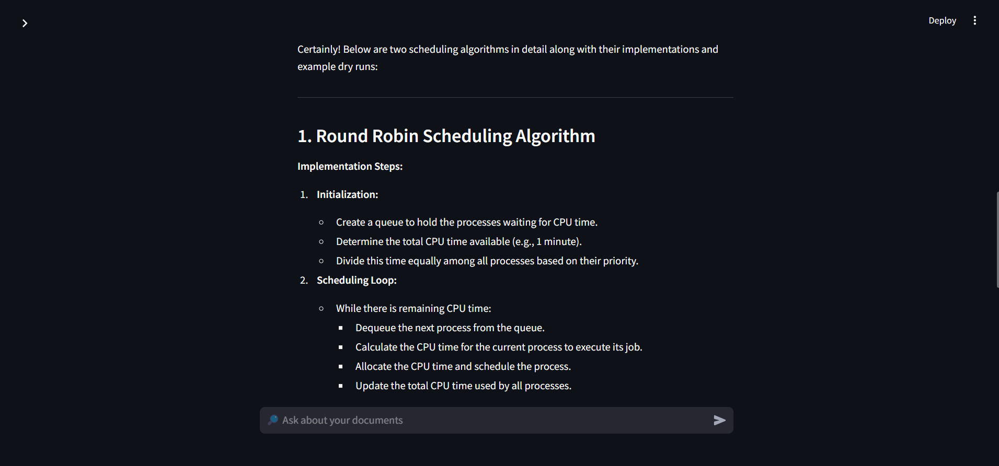
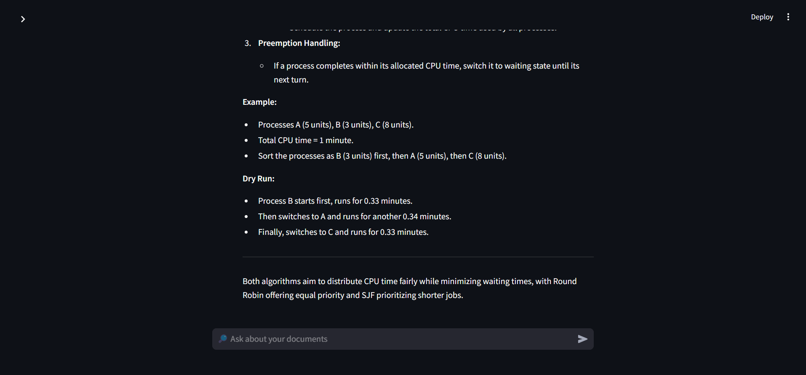

# ChatPDF.ai: Document Q&A with RAG and Non-RAG Approaches
## Table of Contents  
- [Project Overview](#project-overview)  
- [How It Works](#how-it-works)  
- [Technical Architecture](#technical-architecture)  
  - [Deepseek R1-1.5B (RAG) Approach](#deepseek-r1-15b-rag-approach)  
  - [HuggingFace Flan-T5 (Non-RAG) Approach](#huggingface-flan-t5-non-rag-approach)
- [Directory Structure](#directory-structure)    
- [Utility Functions](#utility-functions)  
- [Comparison of RAG vs. Non-RAG](#comparison-of-rag-vs-non-rag-approaches)  
- [How to Run the Application](#how-to-run-the-application)  
- [User Interface Screenshots](#user-interface-screenshots)
- [Performance Benchmarks](#performance-benchmarks)
- [Code Structure and Key Components](#code-structure-and-key-components)
- [Performance Considerations](#performance-considerations)
- [Known Limitations](known-limitations)
- [Future Improvements](#future-improvements)  

## Project Overview

ChatPDF.ai is a Streamlit application that enables users to ask questions about their PDF documents. The application offers two different approaches for document question-answering:

1. **Deepseek R1-1.5B (RAG)**: Uses Retrieval-Augmented Generation with the Deepseek model
2. **HuggingFace Flan-T5 (Non-RAG)**: Uses direct LLM answering with Flan-T5 large model


## How It Works

The application follows these main steps:

1. **Document Processing**: Upload PDF files to create a knowledge base
2. **Query Processing**: Ask questions about the content in natural language
3. **Response Generation**: Get answers based on the selected approach

## Technical Architecture

### Deepseek R1-1.5B (RAG) Approach

This approach implements Retrieval-Augmented Generation:

```python
# From test.py - RAG implementation with Deepseek
embeddings = OllamaEmbeddings(model="nomic-embed-text")
vector_store = Chroma.from_documents(splits, embeddings, persist_directory="./chroma_db")
st.session_state.retriever = vector_store.as_retriever(search_type="mmr", search_kwargs={"k": 3})

# When generating answers
llm = ChatOllama(model="deepseek-r1:1.5b", temperature=0.3)
qa_chain = RetrievalQA.from_chain_type(llm, retriever=st.session_state.retriever, chain_type="stuff")
response = qa_chain.invoke({"query": prompt})
answer = response["result"]
```

### HuggingFace Flan-T5 (Non-RAG) Approach

This approach uses a more direct LLM answering technique:

```python
# From test.py - HuggingFace Non-RAG implementation
embeddings = HuggingFaceEmbeddings()
faiss_index = FAISS.from_texts(chunks, embeddings)
st.session_state.retriever = faiss_index.as_retriever()

# Prompt template for HuggingFace
prompt_template = PromptTemplate(
    input_variables=["context", "question"],
    template="Context: {context}\n\nQuestion: {question}\n\nAnswer:"
)

# When generating answers
search_results = st.session_state.retriever.get_relevant_documents(prompt)
context = "\n\n".join([doc.page_content for doc in search_results])
answer = st.session_state.huggingface_chain.run({"context": context, "question": prompt})
```

## Directory Structure
```bash
Directory structure:
└── vvslaxman-rag-norag/
    ├── README.md
    ├── app.py
    ├── pyproject.toml
    ├── rag.py
    ├── requirements.txt
    ├── run.sh
    ├── secrets.toml
    └── deepseek_RAG_PDF_Chatbot/
        ├── chatbot.py
        ├── requirements.txt
        ├── test.py
        ├── utils.py
        ├── UI_ss/
        │   ├── Deepseek/
        │   └── HF/
        ├── __pycache__/
        └── chroma_db/
            ├── chroma.sqlite3
            └── a553d286-b93e-45ff-940f-027d1c60a27a/
                ├── data_level0.bin
                ├── header.bin
                ├── length.bin
                └── link_lists.bin

```
## Utility Functions

The application uses utility functions defined in `utils.py` for document processing:

```python
# From utils.py - Document processing
def process_documents(pdfs):
    # Create temporary directory for PDF storage
    with tempfile.TemporaryDirectory() as temp_dir:
        # Save uploaded PDFs to temp directory
        pdf_paths = []
        for pdf in pdfs:
            path = os.path.join(temp_dir, pdf.name)
            with open(path, "wb") as f:
                f.write(pdf.getbuffer())
            pdf_paths.append(path)
        
        # Load the documents
        documents = []
        for path in pdf_paths:
            loader = PDFPlumberLoader(path)
            documents.extend(loader.load())
        
        # Split documents into chunks
        text_splitter = RecursiveCharacterTextSplitter(
            chunk_size=1200,  
            chunk_overlap=150  
        )
        splits = text_splitter.split_documents(documents)
        
        # Create embeddings and vector store
        embeddings = OllamaEmbeddings(model="nomic-embed-text")
        vector_store = Chroma.from_documents(
            documents=splits,
            embedding=embeddings,
            persist_directory="./chroma_db"
        )
        
        return vector_store
```

## Comparison of RAG vs. Non-RAG Approaches

| Feature | Deepseek R1-1.5B (RAG) | HuggingFace Flan-T5 (Non-RAG) |
|---------|------------------------|--------------------------------|
| Embeddings | OllamaEmbeddings with nomic-embed-text | HuggingFaceEmbeddings |
| Vector Store | Chroma | FAISS |
| LLM | Deepseek R1:1.5b | Flan-T5 large |
| Retrieval | MMR search with k=3 | Standard retrieval |
| Context Integration | Integrated within RetrievalQA chain | Manual via prompt template |

## How to Run the Application

1. **Install Dependencies**:
   ```bash
   pip install -r requirements.txt
   ```

2. **Environment Setup**:
   - Ensure Ollama is installed and running for the RAG approach
   ```bash
   ollama serve
   ```
   - Set up HuggingFace API token for the Non-RAG approach:
   ```bash
   export HUGGINGFACEHUB_API_TOKEN=your_token_here
   ```

3. **Run the Application**:
   ```bash
   streamlit run test.py
   ```

## User Interface Screenshots

Here's what the application looks like when running:

1. **Main Interface**:
   
   <div style="display: flex; justify-content: space-between;">
       
   </div>

   
   The main interface features:
   - PDF document uploader in the sidebar
   - Chat interface in the main panel
   - Model selection radio buttons
   - Create Personalised Knowledge Base
   - Switch between models seamlessly but the catch here is the trained data for each approach will be different cant be restired after switching

3. **Knowledge Base Creation**:
   <div style="display: flex; justify-content: space-between;">
       
       
   </div>
   
   When creating the knowledge base, users will see step-by-step feedback:
   ```
   ### Step 1: Loading and parsing PDFs 📄
   ✅ PDFs loaded successfully!
   
   ### Step 2: Splitting documents into chunks 🔄
   ✅ Documents split into chunks!
   
   ### Step 3: Creating embeddings using Ollama 🧠
   ✅ Embeddings created using Ollama!
   
   ✅ Knowledge Base Created in 5.23 seconds
   ```

4. **Chat Interaction**:
   <div style="display: flex; flex-wrap: wrap; gap: 10px;">
       
       
       
       
   </div>
   
   The chat interface shows:
   - User questions in the user bubble
   - AI responses in the assistant bubble
   - Time taken to generate responses
   - "Copy Answer to Clipboard" button for convenient copying

## Performance Benchmarks  

| Model | Knowledge Base Creation Time (10-page PDF) | Query Response Time |
|-------|--------------------------------|-----------------|
| Deepseek R1-1.5B (RAG) | ~15.23 sec | ~18.8 sec |
| HuggingFace Flan-T5 (Non-RAG) | ~24.85 sec | ~22.1 sec |

*Note: Times may vary based on document size and system hardware.*

## Code Structure and Key Components

The application is structured around these main components:

1. **Session State Management**:
   ```python
   # Initialize session state
   if "selected_model" not in st.session_state:
       st.session_state.selected_model = "Deepseek R1-1.5B (RAG)"
   if "messages" not in st.session_state:
       st.session_state.messages = []
   if "vector_store" not in st.session_state:
       st.session_state.vector_store = None
   # ...additional state variables
   ```

2. **Approach Details**:
   ```python
   approach_details = {
       "Deepseek R1-1.5B (RAG)": {
           "description": "*Retrieval-Augmented Generation (RAG)* with Deepseek R1-1.5B.",
           "tech_stack": "- *ChatOllama* for answering queries\n- *OllamaEmbeddings* for document embeddings\n- *Chroma Vector Store* for retrieval",
       },
       "HuggingFace Flan-T5 (Non-RAG)": {
           "description": "*Direct LLM Answering (Non-RAG)* with Flan-T5 large.",
           "tech_stack": "- *Hugging Face Flan-T5* for response generation\n- *FAISS Vector Store* for retrieval\n- *LLMChain* for query processing",
       },
   }
   ```

3. **Model Switching Logic**:
   ```python
   # Detect approach switch
   if new_model != st.session_state.selected_model:
       st.warning(f"⚠ You selected a different approach: *{st.session_state.selected_model} → {new_model}*")
       if st.button("✅ Confirm & Switch"):
           st.session_state.selected_model = new_model
           st.session_state.messages = []  # Clear past messages
           st.session_state.vector_store = None
           st.session_state.retriever = None
           st.session_state.qa_chain = None
           st.session_state.huggingface_chain = None
           st.rerun()
   ```

## Performance Considerations

- The application measures and displays the time taken for knowledge base creation and query answering
- Chunk size and overlap parameters are tuned for optimal retrieval:
  ```python
  text_splitter = RecursiveCharacterTextSplitter(chunk_size=1200, chunk_overlap=150)
  ```
- Maximum Marginal Relevance (MMR) search is used in the RAG approach to improve result diversity:
  ```python
  retriever = vector_store.as_retriever(search_type="mmr", search_kwargs={"k": 3})
  ```
## Known Limitations  
1. **Switching Models Resets Knowledge Base**  
   - If you switch from **Deepseek (RAG)** to **Flan-T5 (Non-RAG)**, the previous knowledge base will be lost.  
2. **Handling Large PDFs**  
   - Large PDFs may take longer to process due to chunking and embedding time.  
3. **Non-RAG Model is More Prone to Hallucination**  
   - Since Flan-T5 does not use document retrieval, responses may sometimes be less accurate.  

## Future Improvements

1. Add caching for faster repeated queries
2. Implement document source attribution in responses
3. Support for additional file formats beyond PDF
4. Add session management to save chat history
5. Generation of Project code implemenation

